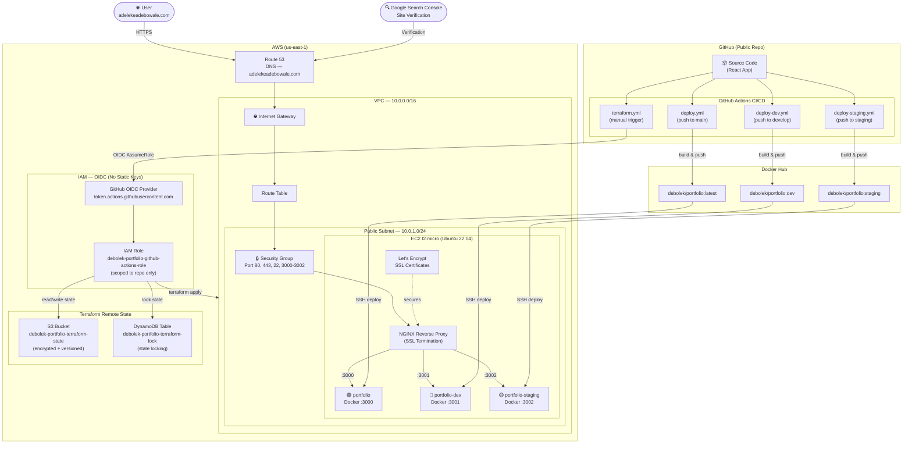

# Adebowale Portfolio Website


A modern, cloud-native portfolio website showcasing DevOps and cloud engineering projects. Built with React and deployed on AWS using containerization, infrastructure as code, and automated CI/CD pipelines.

## 🏛️ Architecture Diagram



## 🌟 Features

- **Modern React Frontend**: Single-page application built with React 18
- **Containerized Deployment**: Docker multi-stage builds for optimized production
- **Infrastructure as Code**: Complete AWS infrastructure managed with Terraform
- **Automated CI/CD**: GitHub Actions pipeline for continuous deployment
- **Cloud Architecture**: Secure AWS VPC, networking, and compute resources
- **Responsive Design**: Mobile-first, fully responsive layout
- **HTTPS Ready**: SSL/TLS configuration with Let's Encrypt

## 🛠️ Technology Stack

### Frontend
- **React** - Component-based UI library
- **React Router** - Client-side routing
- **React Scroll** - Smooth scrolling navigation
- **Font Awesome** - Icon library
- **CSS3** - Custom styling with responsive design

### DevOps & Infrastructure
- **Docker** - Application containerization
- **Terraform** - Infrastructure as Code for AWS
- **GitHub Actions** - CI/CD pipeline automation
- **NGINX** - Web server and reverse proxy
- **Let's Encrypt** - SSL certificate automation

### AWS Services
- **EC2** - t2.micro Ubuntu instance hosting Docker containers
- **VPC** - Isolated network with public subnet (10.0.0.0/16)
- **Internet Gateway** - Public internet access for the VPC
- **Route Table** - Routes traffic from subnet to internet gateway
- **Security Groups** - Firewall rules (HTTP 80, HTTPS 443, SSH 22, ports 3000-3002)
- **S3** - Remote Terraform state storage (encrypted + versioned)
- **DynamoDB** - Terraform state locking table
- **IAM OIDC** - Keyless GitHub Actions authentication (no static AWS keys)
- **IAM Role** - Scoped permissions for GitHub Actions via OIDC
- **Route 53** - DNS management for adelekeadebowale.com

## 🚀 Quick Start

### Prerequisites

- Node.js 18+ and npm
- Docker and Docker Compose
- AWS CLI configured
- Terraform installed
- Git

### Local Development

1. **Clone the repository**
   ```bash
   git clone https://github.com/bowale01/Adebowale-myportfoliopage-app.git
   cd Adebowale-myportfoliopage-app
   ```

2. **Install dependencies**
   ```bash
   npm install
   ```

3. **Start development server**
   ```bash
   npm start
   ```

   The app will be available at `http://localhost:3000`

4. **Build for production**
   ```bash
   npm run build
   ```

### Docker Deployment

1. **Build the Docker image**
   ```bash
   docker build -t bowale01/portfolio:latest .
   ```

2. **Run the container locally**
   ```bash
   docker run -d -p 3000:80 --name portfolio bowale01/portfolio:latest
   ```

3. **Access the application**
   ```
   http://localhost:3000
   ```

## 📦 Infrastructure Deployment

### Terraform Setup

1. **Navigate to infrastructure directory**
   ```bash
   cd infra
   ```

2. **Initialize Terraform**
   ```bash
   terraform init
   ```

3. **Review the infrastructure plan**
   ```bash
   terraform plan
   ```

4. **Deploy the infrastructure**
   ```bash
   terraform apply
   ```

   This will provision:
   - VPC with public subnet
   - Internet Gateway and Route Table
   - Security Group (HTTP, HTTPS, SSH)
   - EC2 instance (t2.micro)

### CI/CD Pipeline Setup

1. **Configure GitHub Secrets**
   - `DOCKERHUB_USERNAME` - Your Docker Hub username
   - `DOCKERHUB_TOKEN` - Docker Hub access token
   - `EC2_HOST` - Your EC2 instance public IP
   - `EC2_SSH_KEY` - SSH private key for EC2 access

2. **Push to main branch**
   ```bash
   git push origin main
   ```

   The GitHub Actions workflow will automatically:
   - Build the Docker image
   - Push to Docker Hub
   - Deploy to EC2 instance

## 🏗️ Project Structure

```
Adebowale-myportfoliopage-app/
├── .github/
│   └── workflows/
│       └── deploy.yml          # CI/CD pipeline
├── infra/
│   ├── main.tf                 # Main Terraform configuration
│   ├── variables.tf            # Terraform variables
│   └── outputs.tf              # Terraform outputs
├── public/
│   ├── index.html              # HTML entry point
│   ├── manifest.json           # PWA manifest
│   └── img/                    # Static images
├── src/
│   ├── Pages/
│   │   └── Home/
│   │       ├── HeroSection.jsx # Hero section component
│   │       ├── Navbar.jsx      # Navigation bar
│   │       ├── MySkills.jsx    # Skills section
│   │       ├── AboutMe.jsx     # About section
│   │       ├── Projects.jsx    # Projects showcase
│   │       ├── ComingSoon.jsx  # Blog placeholder
│   │       ├── ContactMe.jsx   # Contact form
│   │       ├── Footer.jsx      # Footer section
│   │       └── Homescreen/
│   │           └── index.jsx   # Main home page
│   ├── App.js                  # Main App component
│   ├── App.css                 # Global styles
│   └── index.js                # React entry point
├── Dockerfile                  # Multi-stage Docker build
├── package.json                # Node.js dependencies
└── README.md                   # This file
```

## 🔐 Security Considerations

- Security groups configured with least privilege access
- HTTPS/TLS encryption for secure connections
- SSH keys for secure EC2 access
- Docker containers run with minimal privileges
- Regular dependency updates

## 🎯 Customization

### Updating Content

1. **Personal Information**: Edit components in `src/Pages/Home/`
2. **Projects**: Update the projects array in `Projects.jsx`
3. **Skills**: Modify skill items in `MySkills.jsx`
4. **Contact Form**: Update form action in `ContactMe.jsx` (e.g., Formspree)
5. **Social Links**: Change URLs in `HeroSection.jsx` and `Footer.jsx`

### Styling

- Global styles: `src/App.css`
- Component-specific styles: Co-located `.css` files
- Colors and themes: Update CSS variables in component stylesheets

## 📝 License

This project is open source and available under the [MIT License](LICENSE).

## 📧 Contact

**Adeleke Adebowale Julius**
- Website: [https://adelekeadebowale.com](https://adelekeadebowale.com)
- GitHub: [@bowale01](https://github.com/bowale01)
- LinkedIn: [linkedin.com/in/debolek](https://www.linkedin.com/in/debolek/)
- Email: debolek4dem@gmail.com

## 🙏 Acknowledgments

- Built with React and modern web technologies
- Deployed on AWS cloud infrastructure
- Containerized with Docker for consistent deployments
- Automated with GitHub Actions CI/CD pipeline

---

**Note**: Remember to update placeholder content (email addresses, GitHub URLs, domain names, etc.) with your actual information before deploying.
